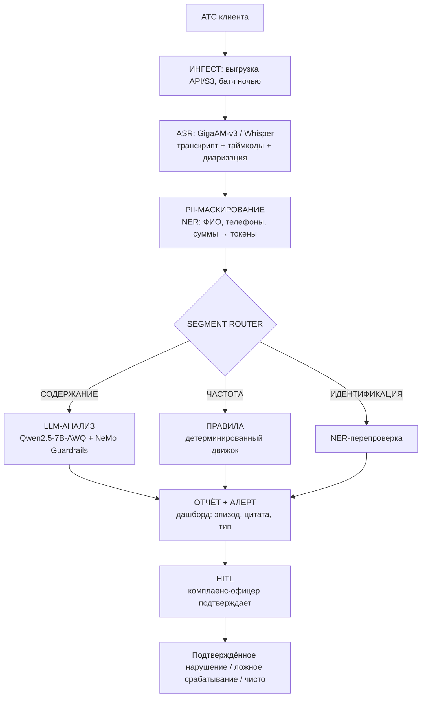

# ИИ-аудит 100% звонков по 230-ФЗ

**Как локальный конвейер ASR + LLM закрывает риск штрафов до 2 млн ₽ за эпизод — в контуре клиента, без выхода персональных данных**

---

## 1. Бизнес-контекст: почему ручной контроль перестал работать

В 2025 году в ФССП поступило **более 34 800 обращений** граждан по фактам нарушения их прав при возврате задолженности — на 4% больше, чем годом ранее. Из них **10 700 обращений** были признаны обоснованными.

Структура этих жалоб — приговор для сегмента МФО. **5 457 обоснованных жалоб (51%)** касались микрофинансовых организаций. Для сравнения: на профессиональные коллекторские агентства пришлось в разы меньше нарушений.

**Цифры, которые должен знать каждый директор по комплаенсу МФО:**

- **34 800** обращений в ФССП за 2025 год
- **10 700** обоснованных жалоб
- **5 457** — на МФО (51% всех обоснованных)
- **208 млн ₽** — общая сумма взысканных штрафов по ст. 14.57 КоАП
- **122 уголовных дела** по ст. 172.4 УК РФ в 2025

С 24 декабря 2024 года штрафы выросли в разы. Для организации нарушение ограничений ч. 1–2 ст. 5 230-ФЗ (ч. 6 ст. 14.57 КоАП) теперь стоит **до 2 млн ₽** — плюс риск дисквалификации должностного лица до 1 года.

**Реальный эпизод.** В 2025 году крупный банк был оштрафован за **27 звонков клиентке за сутки** при законном лимите — 1 звонок в сутки. Один эпизод. Один оператор. Одна ночь. А сколько таких эпизодов проходит мимо выборочного контроля — никто не знает, потому что **прослушивается только 5–10% звонков**.

→ Детали: [passport.md](passport.md)

---

## 2. Почему существующие решения не работают

**Ручная выборка.** Если вы прослушиваете 10% звонков — **90% эпизодов остаются вне поля зрения**. Нарушение фиксируется только после жалобы должника в ФССП.

**Облачные API.** Передача записей третьей стороне = конфликт с 152-ФЗ. Для МФО с сотнями тысяч звонков — ещё и переменная себестоимость, которая убивает маржинальность.

**Готовые системы контроля качества.** Заточены под общий контроль сервиса: не считают частоту с учётом роботов-коллекторов, не детектируют раскрытие ПДн третьим лицам, не проверяют время звонка в местном часовом поясе должника.

**Задача лежит на пересечении трёх требований:** 100% покрытие, данные не покидают контур, специфика 230-ФЗ. Ни одно готовое решение не закрывает все три одновременно.

→ Детали процесса: [process.md](process.md)

---

## 3. Архитектура: конвейер из 8 шагов

**5 ключевых trade-offs:**

1. **Частоту считает детерминированный движок, а не LLM.** Регуляторное число — жёсткое правило. LLM занимается только содержанием.
2. **INT4 (AWQ) вместо FP8.** FP8 на A100 невозможен; на 4090 практичнее AWQ INT4.
3. **HITL — архитектурный принцип.** Система выдаёт кандидатов в нарушения, не подтверждённые нарушения.
4. **PII-маскирование между ASR и LLM.** LLM физически не видит ПДн.
5. **Фрагментный роутинг.** Только значимые фрагменты доходят до LLM. 4090 обрабатывает в 2–3 раза больше звонков.

→ Детали: [architecture.md](architecture.md)

---

## 4. Production Engineering: качество и безопасность

- **Eval harness:** детерминированные проверки → LLM-as-judge. Gate в CI.
- **Golden set:** 500–1000 размеченных кейсов. Обновление ежеквартально.
- **ASR:** GigaAM-v3 — WER 9.5–10.3% на Callcenter vs Whisper 23.9%.
- **Guardrails:** NeMo Guardrails (инъекции), Garak (фаззинг), DeepEval (качество).
- **Бэкдоры:** ModelScan для проверки весов.
- **HITL:** обязательный элемент юридического контура.

---

## 5. Метрики и результат

| Метрика | До | После |
|---------|-----|-------|
| Покрытие аудита | 5–10% | **100%** |
| Время до обнаружения | Дни–недели | **≤ 24 часа** |
| OPEX | — | ~12–19 тыс. ₽/мес ⚠️ |
| Точка окупаемости | — | **1 предотвращённый эпизод** (до 2 млн ₽) |

**Цель аудита:** не «остановить нарушение в момент разговора», а **найти скрытые существующие нарушения в работе КЦ до того, как их обнаружит регулятор или должник пожалуется, чтобы искоренить их в процессах клиента**.

→ Детали: [metrics.md](metrics.md)

---

## 6. Ограничения и допущения

- **WER на вашем аудио — неизвестен.** Требует замера на golden set.
- **NER на синтетике ≠ NER на реальных данных.** Нужна валидация.
- **Одна RTX 4090 — для малой МФО.** 300k+ звонков — кластер.
- **Облачные АТС — отдельный путь интеграции.**
- **Real-time не поддерживается — только батч.**
- **HITL — условие, а не опция.**

→ Детали: [limitations.md](limitations.md)

---

## 7. Что дальше

Предлагаю начать не с покупки, а с измерения:

1. **Пилот на N звонков.** Берём выборку ваших записей (обезличенных), прогоняем через конвейер, сравниваем с текущим контролем.
2. **Аудит текущего контроля.** Смотрим, как устроен процесс: АТС, хранение записей, кто прослушивает.
3. **Решение — после пилота.** Если цифры устраивают — обсуждаем внедрение.

**Контакт:** [ваши данные]

---

## Структура репозитория

- [passport.md](passport.md) — Паспорт боли (кто страдает, что болит)
- [process.md](process.md) — 7 зон контроля 230-ФЗ
- [architecture.md](architecture.md) — конвейер + 5 trade-offs
- [metrics.md](metrics.md) — метрики и результат
- [limitations.md](limitations.md) — ограничения и допущения
- `mvp/` — работающий прототип (в разработке)
- `demo/` — демо-материалы (в разработке)
