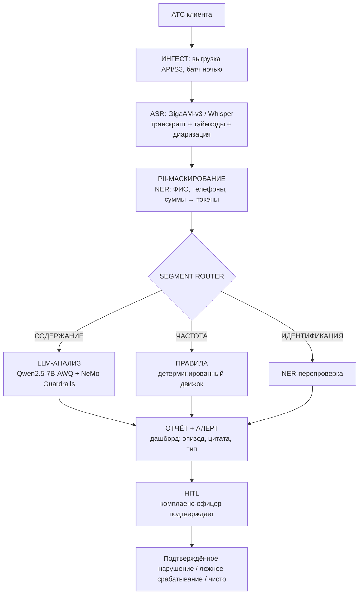

# Архитектура решения и trade-offs

## Главный принцип

Конвейер строится вокруг данных, а не вокруг модели. LLM — один из восьми шагов. Она не «мозг системы», а исполнитель одной конкретной задачи.

## Схема конвейера

## Trade-off 1: Частоту считает детерминированный движок, а не LLM

LLM не считает, сколько раз звонили должнику. LLM не проверяет, в какое время был звонок. Эти числа считает **детерминированный движок на событийном стриме**.

**Почему:** LLM может галлюцинировать. Регуляторное число («8 звонков в месяц») — жёсткое правило из 230-ФЗ. Его считает код, а не модель.

LLM занимается только **содержанием разговора** (давление, угрозы, раскрытие ПДн третьим лицам).

## Trade-off 2: INT4 (AWQ) вместо FP8

**FP8 на A100 физически невозможен** — A100 это Ampere, нет аппаратной поддержки FP8. FP8 появился только в Hopper (H100) и Ada (RTX 4090).

**На RTX 4090 FP8 формально есть**, но vLLM-ядра для FP8 заточены под Hopper. На Ada работают, но не оптимально.

**Практичный путь для 4090 — INT4 (AWQ).** Qwen2.5-7B в AWQ INT4 занимает ~5.3–5.6 ГБ на диске и требует ~6.5 ГБ VRAM. На 4090 (24 ГБ) остаётся запас под KV cache для батчевой обработки.

**Для CISO:** FP8 на 4090 работает, но INT4 AWQ даёт проверенный, стабильный результат с минимальным риском kernel mismatch.

## Trade-off 3: HITL — архитектурный принцип, не «фича»

Human-in-the-loop встроен после формирования отчёта, но до любых юридических действий.

**Почему:** автоматические методы оценки LLM склонны к пропуску тонких случаев. Если система «увидела» нарушение — это **кандидат в нарушения**, а не подтверждённое нарушение.

Это снимает два риска:
- Ложное обвинение оператора (FP). Человек отсеивает.
- Ответственность за ошибку ИИ. Юридическое действие всегда инициирует человек.

## Trade-off 4: PII-маскирование между ASR и LLM

Транскрипт обезличивается до того, как его увидит LLM.

**Почему:** если ПДн попадают в промпт, они обрабатываются моделью. Это нарушает принцип минимизации 152-ФЗ и создаёт риск утечки через логи LLM.

**Как работает:**
1. ASR создаёт транскрипт с реальными ПДн.
2. NER-модель находит сущности и заменяет токенами: `<PERSON_1>`, `<PHONE_1>`, `<AMOUNT_1>`.
3. LLM получает токенизированный текст. Она физически не видит ПДн.
4. Оригинал хранится в защищённом хранилище, доступ — по ролевой модели.

**Важно:** до ASR маскируются только метаданные (номер звонящего, ФИО из CRM). Содержание разговора обезличивается только после распознавания. Правильная формулировка — «PII-маскирование между ASR и LLM».

## Trade-off 5: Фрагментный роутинг вместо полного прогона

**Проблема:** трёхминутный разговор неоднороден. Значимый фрагмент, где может быть нарушение, — 10–30 секунд. Без роутинга LLM получает весь транскрипт: молчание, гудки, «алло-алло». Это сжигает GPU впустую и увеличивает риск галлюцинаций.

**Решение:** между PII-маскированием и LLM встраивается **Segment Router**. Он решает не «какую модель использовать», а **«стоит ли этот фрагмент показывать LLM»**.

**Как работает:**
1. Правиловый предфильтр: отсекает 60–70% «мусорных» фрагментов. LLM не вызывается.
2. Семантический роутер (эмбеддинги): маркирует фрагмент как `[ЧАСТОТА]`, `[СОДЕРЖАНИЕ]`, `[ИДЕНТИФИКАЦИЯ]`.
3. Только `[СОДЕРЖАНИЕ]` вызывает Qwen 7B.

**Что это даёт:**
- Одна 4090 обрабатывает в 2–3 раза больше звонков, чем наивная схема.
- Снижение риска галлюцинаций — модель работает только со структурно выделенными фрагментами.

**Для CISO:** это production-решение, а не демо. Дорогой инференс тратится только там, где создаёт ценность.
